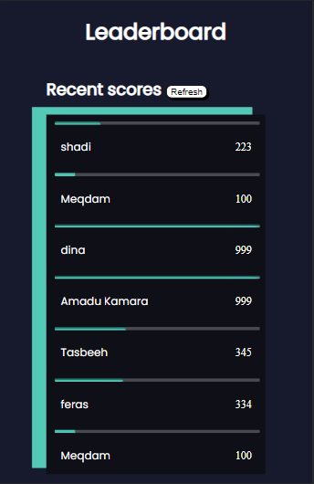

# Project Name

Leaderboard

# PR

1-Add items to the Leaderboard
2-send Add items to an API

## Built With

- Html
- css
- JavaScript

## live demo :
-not yet

## Getting Started

-open the index.html file in chrome and see the Leaderboard

### Setup

-click the code button in the repo and then download the files as a zip file

#### To get a local copy up and running follow these simple example steps.

- Click the green `Code` button on the repo and copy link
- In your local PC, open your terminal in the folder you would like to clone the project.
- Clone the repo with the command: `git clone (copied link)`; like so: `git clone https://github.com/MeqdamAlqudah/Leaderboard`
- On the terminal, navigate into the directory like so: `cd Leaderboard`

### Prerequisites

Chrome or any explorer

## Authors

👤 **Meqdam Al-qudah**

- [GitHub](https://github.com/MeqdamAlqudah)
- [Twitter](https://twitter.com/MeqdamQudah)
- [LinkedIn](www.linkedin.com/in/meqdam-al-qudah-7514a21b5)

## 🤝 Contributing

Contributions, issues, and feature requests are welcome!

Feel free to check the [issues page](../../issues/).

## Show your support

Give a ⭐️ if you like this project!

## Acknowledgments

- Hat tip to anyone whose code was used
- Inspiration
- etc

## 📝 License

This project is [MIT](./MIT.md) licensed.
